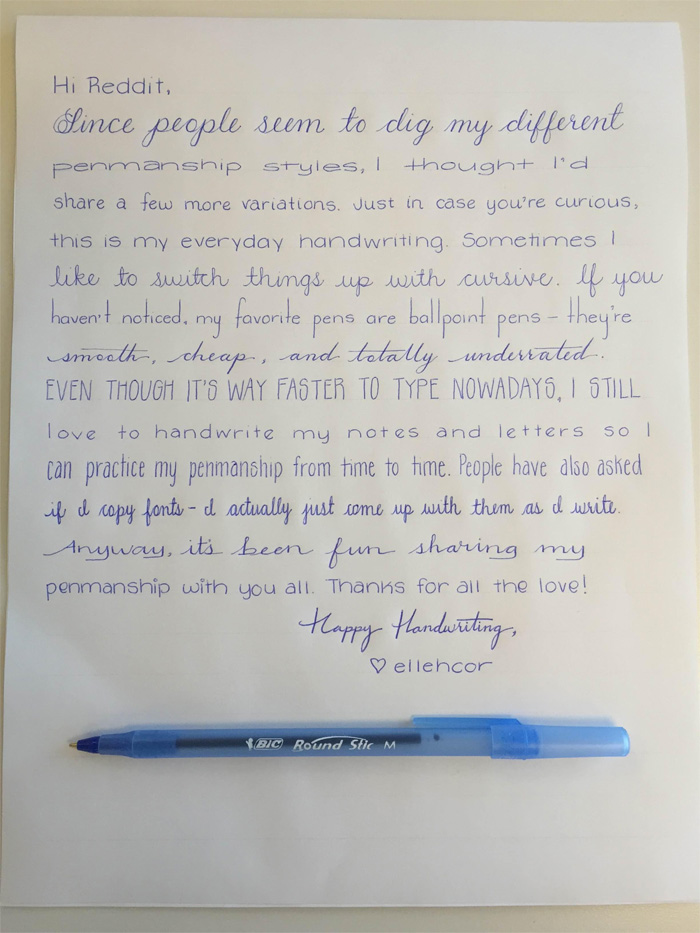
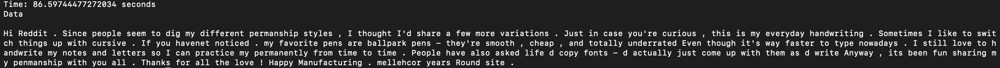

# 📝 Handwritten Text Recognition using TrOCR + CRAFT

This project leverages **Microsoft's TrOCR (Transformer OCR)** and **CRAFT (Character Region Awareness for Text detection)** to extract and recognize handwritten or printed text from images. It includes end-to-end detection and recognition, particularly optimized for handwritten content.




---

## 🚀 Features

- ✍️ Detects handwritten or printed text regions using **CRAFT**
- 🤖 Recognizes text using **Microsoft's TrOCR Transformer model**
- 📦 Easy to use and extensible
- 🧠 Supports `trocr-large-handwritten` model for high-accuracy handwriting recognition
- 📸 Input/output image support for visual verification

---

## 🧰 Tech Stack

- Python
- [CRAFT Text Detector](https://github.com/clovaai/CRAFT-pytorch)
- [Microsoft TrOCR](https://huggingface.co/microsoft/trocr-large-handwritten)
- PyTorch
- Hugging Face Transformers
- OpenCV & PIL

---

## 📂 Project Structure

```
📁 TrOCR_CRAFT/
│
├── trocr_craft.py          # Main script for detection and recognition
├── Input.png               # Sample input image
├── Final_output.png        # Output annotated or processed image (if applicable)
├── requirements.txt        # Required dependencies
└── README.md               # Project documentation (this file)
```

---

## 📸 Example Output

### ✅ Input Image:
An image with handwritten text, processed using CRAFT for region detection.

### 🔍 Recognized Text:
Example output from `trocr_craft.py`:
```
Hi Reddit, Since people seem to dig my different penmanship styles, I thought I'd...
```

---

## 📦 Installation

1. **Clone this repo**:
```bash
git clone https://github.com/varshinivaddepalli/TROCR_CRAFT
cd TrOCR_CRAFT
```

2. **Create a virtual environment (optional but recommended)**:
```bash
python -m venv venv
source venv/bin/activate  # or venv\Scripts\activate on Windows
```

3. **Install dependencies**:
```bash
pip install -r requirements.txt
```

---

## ⚙️ How to Run

```bash
python trocr_craft.py
```

This will:
- Load the image from `Input.png`
- Detect text boxes using CRAFT
- Recognize text using TrOCR
- Print the final output text and time taken

---

## 🧪 Sample Output

```bash
Time: 8.38 seconds

Data
Hi Reddit, Since people seem to dig my different penmanship styles...
```

---

## 📥 Requirements

Included in `requirements.txt`, but major libraries:
- `torch`
- `transformers`
- `craft-text-detector`
- `opencv-python`
- `Pillow`

---

## 🧹 Cleanup

To unload the CRAFT model and clear memory:

```python
craft.unload_craftnet_model()
gc.collect()
torch.cuda.empty_cache()
```

---

## 💡 Notes

- CPU-only inference (`cuda=False`) is set by default. Modify `cuda=True` in `Craft(...)` if using GPU.
- Large models like `trocr-large-handwritten` provide better accuracy but are resource-intensive.

---

## 🧑‍💻 Author

**Varshini Vaddepalli**  

---
